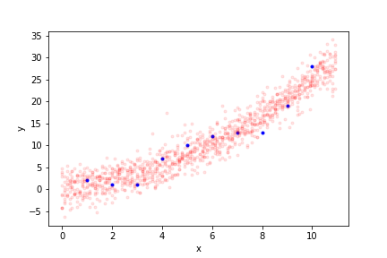

# Pangolin

Pangolin is a probabilistic programming interface focused on **fun**. The goal is to be the "first" probabilistic programming language, to bring out the underlying mathematical elegance and simplicity of probabilistic reasoning, and to make easy things easy.  It should feel particularly natural to Python programmers familiar with numpy.

Most of the actual *work* of Pangolin is done by Martin Plummer's legendary [JAGS](https://sourceforge.net/projects/mcmc-jags/) package. Essentially, Pangolin is a Python interface that generates JAGS code and then calls JAGS on demand, so it "feels" like everything is happening in python.

To use pangolin you just need to install JAGS and download the single file [`pangolin.py`](pangolin.py).

Note: Pangolin is "academia-ware", a single 1800 line file written by one person.

# Quick examples

What's the mean and variance of a Bernoulli distribution?

```python
from pangolin import d, E, var
x = d.bern(0.25)
E(x), var(x)
>> (0.277, 0.200271)
```

Do the same thing much more accurately:

```python
from pangolin import d, E, var
x = d.bern(0.25)
E(x,niter=1000000), var(x,niter=1000000)
>> (0.250237, 0.187192623004)
```

Say that $x$ is a standard Gaussian variable and $y$ is $x$ with extra Gaussian noise. What's the correlation of $x$ and $y$?

```python
from pangolin import d, corr
x = d.norm(0,1)
y = d.norm(x,1)
corr(x,y)
>> 0.7057903530951414
```

Simple nonlinear regression.

```python
from pangolin import d, t, sample, Given, vmap
import numpy as np
from matplotlib import pyplot as plt

# training data
x_train = np.array([1,2,3,4,5,6,7,8,9,10])
y_train = np.array([2,1,1,7,10,12,13,13,19,28])

# test inputs
x_test = np.arange(0,11,.1)

# define diagonal normal distribution; vectorize over mean only
diag_norm = vmap(d.norm,[True,False])

# model for training and test data
w0     = d.norm(0,.10)      # bias term
w1     = d.norm(0,.10)      # linear term
w2     = d.norm(0,.10)      # quadratic term
s      = t.exp(d.norm(0,1)) # noise strength
y      = diag_norm(w0 + w1*x_train + w2*x_train**2,1/s)
y_test = diag_norm(w0 + w1*x_test  + w2*x_test**2 ,1/s)

# do inference
y_pred = sample(y_test,Given(y==y_train))

# plot results
plt.plot(x_train,y_train,'b.')
plt.plot(x_test,np.array(y_pred)[::100,:].T,'r.',alpha=0.1);
plt.xlabel('x')
plt.ylabel('y')
plt.savefig('regression.png')
```




And here's Tverysky and Kehneman's famous 1977 [taxicab problem](https://www.oxfordreference.com/view/10.1093/oi/authority.20110803102304404): There's a city where 85% of taxis are green and 15% are blue. Some taxi was involved in a hit-and-run incident, and a witness identified the taxi as blue. Under some testing under similar conditions, this witness was able to correctly identify the color of the taxi in 80% of cases. What are the odds that the taxi really is blue?

```python
from pangolin import d, t, P, Given

# taxicab is Green (1) with probability 0.85.
taxicab_color  = d.bern(0.85)

# People report color Green (1) with probability 
# 0.8 if taxicab was Green (1), and 
# 0.2 if taxicab was Blue (0).

reported_color = d.bern(
    t.ifelse(taxicab_color==1, 0.8, 0.2)
)
# Find the probability of taxicab being blue 
# given that the reported color was blue.
P(taxicab_color==0, Given(reported_color==0))

>> 0.4138
```

More examples:
* [Tutorial](Example-Tutorial.ipynb)
* [Gaussian Process Regression](Example-GP-regression.ipynb)
* [Hierarchical Regression](Example-Hierarchical-Regression.ipynb)
* [Time Series](Example-Time-series.ipynb)
* [Simulation Based Calibration](Example-Simulation-Based-Calibration.ipynb)
* [Using `vmap`](Example-Using-vmap.ipynb)
* [Using `scan`](Example-Using-scan.ipynb)

# FAQ

**Why use JAGS rather than [STAN](https://mc-stan.org/) or [NumPyro](https://num.pyro.ai/en/stable/getting_started.html) or [PyMC](https://www.pymc.io/welcome.html)?**

Either because (a) it's simpler, and "looks more like math", (b) you want to be more tightly integrated into the rest of the python universe, or (c) just because JAGS has better support for discrete variables. All these systems primary use Hamiltonian Monte Carlo (HMC) as a sampling method, which is typically more efficient than the "Gibbs + many many tricks" method that JAGS uses. But HMC is not easy to adapt to work with discrete variables. Some of these systems (like PyMC) do allow discrete variables but these require using a entirely different sampling methods, which are less tested and robust than JAGS or the HMC algorithms in STAN/NumPyro/PyMC/etc.

**Why use Pangolin rather than JAGS itself?**

Because it's (hopefully) easier.

**Why "Pangolin"?**

Because keratin scales make up around 20% of the body weight of pangolins—which is emblematic of something or other with Bayesian inference.

# Installation

1. Install [JAGS](https://sourceforge.net/projects/mcmc-jags/) and make sure that it is in your path. After you've done this, if you type `jags` at the command line you should see something like this:

```shell
% jags
Welcome to JAGS 4.3.1 on Thu Jab 1 00:00:00 1970
JAGS is free software and comes with ABSOLUTELY NO WARRANTY
Loading module: basemod: ok
Loading module: bugs: ok
.
```
2. Pangolin is a single file. Download [it](pangolin.py) and put it in the directory you're working.

# API

At a high level, this is the full API:
* `d.*` - distributions (see below)
* `t.*` - transformations (see below)
  * Also the infix operators `+`, `*`, `/`, `**`, and `@`
* `IID`, `vmap`, `recurse`, `scan` - vectorization operators
* `sample`, `E`, `P`, `var`, `std`, `cov`, `corr` - inference
* `I` - Iverson operator (convert Equalities to random variables)
* `makerv` convert a number or numpy array to a random variable (rarely needed)
* `jags_code` - see raw JAGS code

Using `d.norm` to access the Gaussian distribution is intended to follow as closely as possible the conventions of JAGS. For more description of these distributions see the [JAGS user manual](https://sourceforge.net/projects/mcmc-jags/files/Manuals/4.x/). 

## Distributions

**Continuous univariate distributions** (sec 9.2.1 of JAGS user manual)

```python
d.beta(a,b)        # Beta
d.chisqr(a)        # Chi squared
d.dexp(a,b)        # Double eponential (or laplace)
d.exp(a)           # Exponential
d.f(a,b)           # F distribution
d.gamma(a,b)       # Gamma
d.gen_gamma(a,b,c) # Generalized gamma
d.logis(a,b)       # Logistic distribution
d.lnorm(a,b)       # Lognormal distribution
d.nchisqr(a,b)     # Non-central chi-squared
d.nt(a,b)          # Non-central t
d.norm(a,b)        # Normal distribution USES PRECISION NOT VARIANCE
d.par(a,b)         # Pareto
d.t(a,b,c)         # Student T
d.unif(a,b)        # Uniform
d.web(a,b)         # Weibull
```

Note that like in JAGS, the normal distribution uses PRECISION, not VARIANCE for the second parameter. (For scalars, precision is 1/variance.)

**Discrete univariate distributions**  (sec 9.2.2 of JAGS user manual)

```python
d.bern(a)           # Bernoulli
d.binom(a,b)        # Binomial
d.cat(a)            # Categorical
d.hyper(a,b,c,d)    # Noncentral hypergeometric
d.negbin(a,b)       # Negative binomial
d.pois(a)           # Poisson
```

**Multivariate** (sec 9.2.3 of JAGS user manual)


```python
d.dirch(a)          # Dirichlet
d.mnorm(a,b)        # Multivariate normal USES PRECISION NOT COVARIANCE
d.mnorm_vcov(a,b)   # Multivariate normal THIS ONE USES COVARIANCE
d.mt(a,b,c)         # Multivariate t
d.multi(a,b)        # Multinomial
d.sample(a,b)       # Sampling without replacement (JAGS user manual has typo in title)
d.wish(a,b)         # Wishart
```

There's also one special distribution, a special sampling module has to be loaded if you use it. (Pangolin does this automatically.)

```python
d.normmix(a,b,c)    # Mixture of 1-D normals
```

**CDFs etc** (A seemingly somewhat random subset of the scalar distributions provide CDFs and quantiles (inverse CDFs) — table 6.2 of JAGS user manual)

You can do things like 

```python
d.norm(0,1).cdf(.7)
d.norm(0,1).quantile(-0.5)
```

## Transformations

```python
t.sum(a)            # sum of elements in a 1-d vector
t.ifelse(x,a,b)     # x must be an Equality. If x is true, gives a otherwise b.
t.equals(a,b)       # 1 if a equals b otherwise 0
```

**Scalar functions**  (see table 9.1 in JAGS user manual)

These functions are all automatically vectorized according to JAGS rules. If `fun` is a scalar function you can do `fun(a,b,c)` provided that either:
* All `a`, `b`, and `c` are scalars
* All `a`, `b`, and `c` are arrays of the same shape
* Some of `a`, `b`, and `c` are scalars and the rest are arrays of the same shape

Most of these names are self-explanatory.

```python
t.pow(a,b)
t.abs(a)
t.arccos(a)
t.arccosh(a)
t.arcsin(a)
t.arcsinh(a)
t.arctan(a)
t.arctanh(a)
t.cos(a)
t.cosh(a)
t.cloglog(a)
t.exp(a)
t.icloglog(a)
t.ilogit(a)
t.log(a)
t.logfact(a)
t.loggam(a)
t.logit(a)
t.phi(a)
t.probit(a)
t.round(a)
t.sin(a)
t.sinh(a)
t.sqrt(a)
t.step(a)
t.tan(a)
t.tanh(a)
t.trunc(a)
```

**Scalar functions triggered by infix operators**

```python
a + b               # same as t.add(a,b) - elementwise addition
a / b               # same as t.div(a,b) - elementwise division
a * b               # same as t.mul(a,b) - elementwise multiplication
a ** b              # same as t.pow(a,b) - elementwise powers
```

**Matrix functions**

```python
a @ b               # same as t.matmul(a,b) - matrix multiplication
```

Matrix multiplication (`t.matmul` / `@`) tries to copy the semantics of numpy's `@` operator. You can only do it when `a` and `b` are both 1-d or 2-d arrays with compatible dimensions. Then:

* If `a` and `b` are 1-d arrays, `a @ b` is the inner-product.
* If `A` is a 2-d array and `b` is a 1-d array, `A @ b` is matrix-vector multiplication.
* If `a` is a 1-d array and `B` is a 2-d array, `a @ B` is vector-matrix multiplication.
* If `A` and `B` are 2-d arrays, `A @ B` is matrix multiplication.

```python
a.T                 # same as t.t(a) - transpose
```

## Indexing

If `a` is a 1-D array, you can do `a[b]` where `b` is:
* An integer-valued random variable
* Any slice with constant indices

Currently you can't index N-D arrays at all when N>1 (although you can implicitly do this through vectorization).

## Vectorization

Pangolin provides four operators for efficient vectorization: `IID`, `vmap`, `recurse`, and `scan`. (These are inspired by similar operators in Pyro/NumPyro/JAX) They allow you to express random variables that ultimately compile to `for` loops in JAGS. The principal reason to use them is for efficiency.

### IID

```python
IID(x,N)
```

If `x` is any random variable, this returns a new random variable that is `N` iid copies of `x`. The new/independent dimensions are placed first. For example, if `x` were a random variable with shape `(3,2)` then `IID(x,4)` would return a random variable with shape `(4,3,2)`.

### vmap

This is slightly more general (and more complex) than `IID)`, (`IID` is implemented using `vmap`)

```python
vmap(f)(*args)
```

Suppose that `f` is a function that takes some number of inputs and produces a random variable. Then `vmap(f)` is  function that takes the same number of inputs and produces another random variable output, except all inputs and outputs are "expanded" along a new dimension (the first one).

More generally, you can do

```python
vmap(f,vec_pars)(*args)
```

In this case, `vec_pars` is a list of `bool`s. This says if each parent variable should be vectorized.

For example, these are legal uses of `vmap`:

* `vmap(d.norm)([1,2,3],[4,5,6])`  
  a normal distribution with mean `[1,2,3]` and diagonal precision `[4,5,6]`.
* `vmap(d.norm,[True,False])([1,2,3],4)`  
  a normal distribution with mean `[1,2,3]` and diagonal precision `[4,4,4]`.
* `vmap(d.norm,[False,True])(1,[4,5,6])`  
  a normal distribution with mean `[1,1,1]` and diagonal precision `[4,5,6]`.

You can't do `vmap(d.norm,[False,False])` since this doesn't vectorize over anything. (If you want this, use `IID`.)

### recurse

```python
out = recurse(f)(init,input)
```

This is semantically equivalent to this python code:

```python
carry = init
out = []
for my_input in input:
    carry = f(carry,my_input)
    out.append(carry)
return np.stack(out)
```

This also works when there are multiple inputs, e.g. you can do

```python
out = recurse(f,init,input1,input2)
```

Which is semantically equivalent to:

```python
carry = init
out = []
for my_input in input:
    carry = f(carry,my_input)
    out.append(carry)
return np.stack(out)
```

### scan

This is slightly more general (and more complicated) than `recurse`. (`recurse` is implemented using `scan`)

A call to `scan` looks much like a call to `recurse`:

```python
out = scan(f)(init,input)
```

The difference is that in `scan`, `f` is assumed to be a function that produces *two* outputs. One is the "carry" and the other is the "output". The above call corresponds roughly to:

```python
carry = init
out = []
for my_input in input:
    carry,my_out = f(carry,my_input)
    out.append(my_out)
return np.stack(out)
```

## Equalities

If `x` and `y` are random variables and you do `x==y`, this produces an `Equality` object. You also get an equality if you do `x>=y` or `x<=y`.

`Equality`s are *not* random variables. If you want to convert an `Equality` into a random variable you should use `I` (the Iverson operator).

So, for example,

```python
I(x==y)
```

is a random variable that is 1 if x==y and 0 otherwise.

## Inference

The most basic routine is sampling

```python
sample(x)                       # get samples for the random variable x
sample(x,niter=50)              # do 500 iterations (default 1000)
sample(x,Given(y==2))           # get conditional samples
sample([x,y],Given(z==2,u>=7))  # conditional samples for two variables
```

But for convenience you can also get expectations

```python
E(x)
E([x,y])
E([x,y],Given(z==2,u>=7),niter=50)
```

You can similarly use `P` for probabilities (or densities), `var` for the variance (elementwise over all inputs) `std` for the standard deviation (elementwise) `cov` for the covariance (scalars only) and `corr` for the covarince (scalars only). All these methods are computed using a single set of samples so the results can't be nonsensical—e.g. `var` cannot be negative, `corr` cannot be larger than one.

## Misc

```python
jags_code(x)
```

This shows the JAGS code that the model would output for random variable `x` (or list of random variables) In principle you should never need to use this but might be useful in practice.
