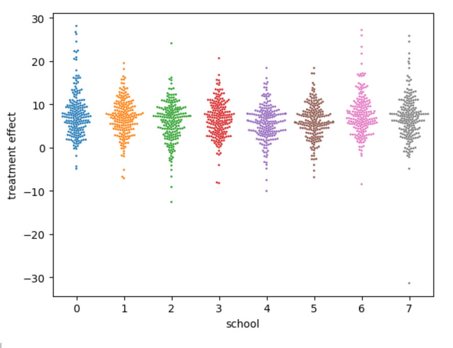

Pangolin's goal is to be **the world's friendliest probabilistic programming language** and to make probabilistic inference **fun**. It is still something of a research project.

## Installation

See [`INSTALL.md`](INSTALL.md)

## Changelog

See [`CHANGELOG.md`](CHANGELOG.md)

## API Docs

See [justindomke.github.io/pangolin](https://justindomke.github.io/pangolin/).

## Examples and comparisons

### Simple "probabilistic calculator"

If `z ~ normal(0,2)` and `x ~ normal(0,6)` then what is `E[z | x = -10]`?

```python
from pangolin import interface as pi
from pangolin.blackjax import E

z = pi.normal(0,2)
x = pi.normal(x,6)
print(E(z, x, -10.0))
```

Here is the same model in other PPLs. (Or see [calculator-ppls.ipynb](demos/calculator-ppls.ipynb).)

<details markdown="1" name="calculator">
<summary>PyMC</summary>

```python
import pymc as pm

with pm.Model():
    z = pm.Normal('z', 0, 2)
    x = pm.Normal('x', z, 6, observed=-10)
    trace = pm.sample(chains=1)
    z_samps = trace.posterior['z'].values
    print(np.mean(z_samps))
```

</details>


<details markdown="1" name="calculator">
<summary>Pyro</summary>

```python
import pyro
import torch

def model():
    z = pyro.sample('z', pyro.distributions.Normal(0, 2))
    x = pyro.sample('x', pyro.distributions.Normal(z, 6), obs=torch.tensor(-10.0))

nuts_kernel = pyro.infer.mcmc.NUTS(model)
mcmc = pyro.infer.mcmc.MCMC(nuts_kernel, warmup_steps=500, num_samples=1000, num_chains=1)
mcmc.run()
z_samps = mcmc.get_samples()['z'].numpy()
print(np.mean(z_samps))
```

</details>


<details markdown="1" name="calculator">
<summary>NumPyro</summary>

```python
import numpyro
import jax
import jax.numpy as jnp

def model():
    z = numpyro.sample('z', numpyro.distributions.Normal(0, 2))
    x = numpyro.sample('x', numpyro.distributions.Normal(z, 6), obs=-10)

nuts_kernel = numpyro.infer.NUTS(model)
mcmc = numpyro.infer.MCMC(nuts_kernel, num_warmup=500, num_samples=1000, num_chains=1)
mcmc.run(jax.random.PRNGKey(42))
z_samps = mcmc.get_samples()['z']
print(np.mean(z_samps))
```

</details>


<details markdown="1" name="calculator">
<summary>JAGS</summary>

```python
import pyjags

model_code = """
model {
  z ~ dnorm(0, 1/2^2)
  x ~ dnorm(z, 1/6^2)
}
"""

model = pyjags.Model(
    code=model_code,
    data={'x': -10},
    chains=1,
    adapt=500
)

samples = model.sample(1000, ['z'])
z_samps = samples['z'].flatten()
print(np.mean(z_samps))
```

</details>

<details markdown="1" name="calculator">
<summary>Stan</summary>

```python
import cmdstanpy
import tempfile
from pathlib import Path

stan_code = """
data {
  real x;
}
parameters {
  real z;
}
model {
  z ~ normal(0, 2);
  x ~ normal(z, 6);
}
"""

with tempfile.TemporaryDirectory() as tmpdir:
    stan_file = Path(tmpdir) / "calculator_model.stan"
    stan_file.write_text(stan_code)

    model = cmdstanpy.CmdStanModel(stan_file=str(stan_file))

    fit = model.sample(
        data={'x': -10.0},
        chains=1,
        iter_warmup=500,
        iter_sampling=1000,
        seed=42
    )
    z_samps = fit.stan_variable('z')

    print(np.mean(z_samps))
```

</details>

### Beta-Bernoulli model

This is arguably the simplest Bayesian model. If you've seen a bunch of coinflips from a bent coin, what is the true bias? To start, generate synthetic data.

```python
import numpy as np
import pangolin
from pangolin import interface as pi

# create synthetic data
z_true = 0.7
N = 100
x_obs = np.random.binomial(1, z_true, N)

# do inference
z = pi.beta(2,2)
x = pi.vmap(pi.bernoulli, None, N)(z)
z_samps = pangolin.blackjax.sample(z, x, x_obs)
print(np.mean(z_samps), np.std(z_samps))
```

Here is the same model in other PPLs. (Or see [beta-bernoulli-ppls.ipynb](demos/beta-bernoulli-ppls.ipynb).)


<details markdown="1" name="bb">
<summary>PyMC</summary>

```python
import pymc as pm

with pm.Model() as coin_model:
    z = pm.Beta('z', alpha=2, beta=2)
    x = pm.Bernoulli('x', z, observed=x_obs)
    trace = pm.sample(chains=1)
    z_samps = trace.posterior['z'].values
    print(np.mean(z_samps), np.std(z_samps))
```

</details>


<details markdown="1" name="bb">
<summary>Pyro</summary>

```python
import pyro
import torch

x_obs_torch = torch.tensor(x_obs, dtype=torch.float)

def model():
    z = pyro.sample('z', pyro.distributions.Beta(2.0, 2.0))
    with pyro.plate('N', N):
        x = pyro.sample('x', pyro.distributions.Bernoulli(z), obs=x_obs_torch)

nuts_kernel = pyro.infer.mcmc.NUTS(model)
mcmc = pyro.infer.mcmc.MCMC(nuts_kernel, warmup_steps=500, num_samples=1000, num_chains=1)
mcmc.run()
z_samps = mcmc.get_samples()['z'].numpy()
print(np.mean(z_samps), np.std(z_samps))
```

</details>


<details markdown="1" name="bb">
<summary>NumPyro</summary>

```python
import numpyro
import jax
import jax.numpy as jnp

def model():
    z = numpyro.sample('z', numpyro.distributions.Beta(2.0, 2.0))
    with numpyro.plate('data', N):
        x = numpyro.sample('x', numpyro.distributions.Bernoulli(z), obs=x_obs)

nuts_kernel = numpyro.infer.NUTS(model)
mcmc = numpyro.infer.MCMC(nuts_kernel, num_warmup=500, num_samples=1000, num_chains=1)
mcmc.run(jax.random.PRNGKey(42))
z_samps = mcmc.get_samples()['z']
print(np.mean(z_samps), np.std(z_samps))
```

</details>


<details markdown="1" name="bb">
<summary>JAGS</summary>

```python
import pyjags

model_code = """
model {
  z ~ dbeta(2, 2)
  for (i in 1:N) {
    x[i] ~ dbern(z)
  }
}
"""

model = pyjags.Model(
    code=model_code,
    data={'N': N, 'x': x_obs.tolist()},
    chains=1,
    adapt=500
)

samples = model.sample(1000, ['z'])
z_samps = samples['z'].flatten()
print(np.mean(z_samps), np.std(z_samps))
```

</details>


<details markdown="1" name="bb">
<summary>Stan</summary>

```python
import cmdstanpy
import tempfile
from pathlib import Path

stan_code = """
data {
  int<lower=0> N;
  array[N] int<lower=0, upper=1> x;
}
parameters {
  real<lower=0, upper=1> z;
}
model {
  z ~ beta(2, 2);
  x ~ bernoulli(z);
}
"""

with tempfile.TemporaryDirectory() as tmpdir:
    stan_file = Path(tmpdir) / "coin_model.stan"
    stan_file.write_text(stan_code)

    model = cmdstanpy.CmdStanModel(stan_file=str(stan_file))

    fit = model.sample(
        data={'N': N, 'x': x_obs},
        chains=1,
        iter_warmup=500,
        iter_sampling=1000,
        seed=42
    )
    z_samps = fit.stan_variable('z')
    print(np.mean(z_samps), np.std(z_samps))
```

</details>


### Eight-schools

Bayesian inference on the 8-schools model:

```python
# setup
import numpy as np
N = 8
stddevs = np.array([15, 10, 16, 11, 9, 11, 10, 18])
x_obs = np.array([28, 8, -3, 7, -1, 1, 18, 12])

# inference
import pangolin
from pangolin import interface as pi
mu = pi.normal(0,10)
tau = pi.lognormal(0,5)
z = pi.vmap(pi.normal, None, N)(mu, tau)
x = pi.vmap(pi.normal)(z, stddevs)
z_samps = pangolin.blackjax.sample(z, x, x_obs, niter=10000)

# plot
import numpy as np
import seaborn as sns
from matplotlib import pyplot as plt
sns.swarmplot(np.array(theta_samps)[:,::50].T,s=2,zorder=0)
plt.xlabel('school')
plt.ylabel('treatment effect')
```



Here is the same model in other PPLs. (Or see [eight-schools-ppls.ipynb](demos/eight-schools-ppls.ipynb).)

<details markdown="1" name="8schools">
<summary>PyMC</summary>

```python
import pymc as pm

with pm.Model():
    mu = pm.Normal('mu', 0, 10)
    tau = pm.LogNormal('tau', 0, 5)
    z = pm.Normal('z', mu, tau, size=N)
    x = pm.Normal('x', z, stddevs, observed=x_obs)

    trace = pm.sample(draws=10000, chains=1)
    z_samps = trace.posterior['z'].values[0,:,:]
```

</details>

<details markdown="1" name="8schools">
<summary>Pyro</summary>

```python
import pyro
import torch

stddevs_torch = torch.tensor(stddevs)
x_obs_torch = torch.tensor(x_obs)

def model():
    mu = pyro.sample('mu', pyro.distributions.Normal(0, 10))
    tau = pyro.sample('tau', pyro.distributions.LogNormal(0, 5))
    with pyro.plate('N', N):
        z = pyro.sample('z', pyro.distributions.Normal(mu, tau))
        x = pyro.sample('x', pyro.distributions.Normal(z, stddevs_torch), obs=x_obs_torch)

nuts_kernel = pyro.infer.mcmc.NUTS(model)
mcmc = pyro.infer.mcmc.MCMC(nuts_kernel, warmup_steps=500, num_samples=1000, num_chains=1)
mcmc.run()
z_samps = mcmc.get_samples()['z'].numpy()
```

</details>


<details markdown="1" name="8schools">
<summary>NumPyro</summary>

```python
import numpyro
import jax

stddevs_torch = torch.tensor(stddevs)
x_obs_torch = torch.tensor(x_obs)

def model():
    mu = numpyro.sample('mu', numpyro.distributions.Normal(0, 10))
    tau = numpyro.sample('tau', numpyro.distributions.LogNormal(0, 5))
    with numpyro.plate('N',N):
        z = numpyro.sample('z', numpyro.distributions.Normal(mu, tau))
        x = numpyro.sample('x', numpyro.distributions.Normal(z, stddevs), obs=x_obs)

nuts_kernel = numpyro.infer.NUTS(model)
mcmc = numpyro.infer.MCMC(nuts_kernel, num_warmup=500, num_samples=1000, num_chains=1)
mcmc.run(jax.random.PRNGKey(42))
z_samps = mcmc.get_samples()['z']
```

</details>

<details markdown="1" name="8schools">
<summary>JAGS</summary>

```python
import pyjags

model_code = """
model {
  mu ~ dnorm(0, 1/10^2)
  tau ~ dlnorm(0, 1/5^2)
  for (i in 1:N) {
    z[i] ~ dnorm(mu, 1/tau^2)
    x[i] ~ dnorm(z[i], 1/stddevs[i]^2)
  }
}
"""

model = pyjags.Model(
    code=model_code,
    data={'N': N, 'stddevs': stddevs.tolist(), 'x': x_obs.tolist()},
    chains=1,
    adapt=5000
)

samples = model.sample(100000, ['z'])
z_samps = np.array(samples['z'])[:,:,0].T
```

</details>

<details markdown="1" name="8schools">
<summary>Stan</summary>

```python
import cmdstanpy
import tempfile
from pathlib import Path

stan_code = """
data {
  int<lower=0> N;
  array[N] real x;
  array[N] real stddevs;
}
parameters {
  real mu;
  real<lower=0> tau;
  array[N] real z;
}
model {
  mu ~ normal(0, 10);
  tau ~ lognormal(0, 5);
  for (i in 1:N) {
    z[i] ~ normal(mu, tau);
    x[i] ~ normal(z[i], stddevs[i]);
  }
}
"""

with tempfile.TemporaryDirectory() as tmpdir:
    stan_file = Path(tmpdir) / "8schools_model.stan"
    stan_file.write_text(stan_code)

    model = cmdstanpy.CmdStanModel(stan_file=str(stan_file))

    fit = model.sample(
        data={'N': N, 'stddevs': stddevs, 'x': x_obs},
        chains=1,
        iter_warmup=500,
        iter_sampling=1000,
        seed=42
    )
    z_samps = fit.stan_variable('z')
```

</details>

### More examples

For more examples, take a look at the [demos](demos/). Here's a recommended order:

* [IR.ipynb](demos/ir.ipynb) demonstrates pangolin's internal representation of probabilistic models.
* [interface.ipynb](demos/interface.ipynb) demonstrates pangolin's friendly interface and what internal representation it produces.
* [8schools.ipynb](demos/8schools.ipynb) is the classic 8-schools model.
* [regression.ipynb](demos/regression.ipynb) is Bayesian linear regression.
* [timeseries.ipynb](demos/timeseries.ipynb) is a simple timeseries model.
* [scan.ipynb](demos/scan.ipynb) is a Kalman-filter-esque model.
* [GP-regression.ipynb](demos/GP-regression.ipynb) is Gaussian Process regression.
* [1PL.ipynb](demos/1PL.ipynb) is a simple item-response-theory model.
* [2PL.ipynb](demos/2PL.ipynb) is a slightly more complex item-response-theory model.


## Values

(For the current Python interface)

* **Gradual enhancement.** Easy things should be *really* easy. More complex features should be easily discoverable. Steep learning curves should be avoided.
* **Small API surface.** The set of abstractions the user needs to learn should be as small as possible.
* **Graceful interop.** As much as possible, the system should feel lke a natural part of the broader Python NumPy ecosystem, rather than a "new language".
* **Look like math.** As much as possible, calculations should resemble mathematical notation. Exceptions are allowed when algorithmic limitations make this impossible or where standard mathematical notation is ambiguous or bad.

## Long-term goals

Long-term, Pangolin has the following goals:

1. To "decouple" probabilistic models from inference algorithms. It should be possible to write a model *once*, and then perform inference using many inference "backends". (Among other things, this should facilitate benchmarks)
2. To make it easier to experiment with novel inference algorithms that inspect the target distribution. 
3. To support different possible interfaces, in different languages.
4. To be "unopinionated" about how users might specify models, and how inference might be done.


## See also

An earlier version of Pangolin is available and based on much the same ideas, except only supporting JAGS as a backend. It can be found with documentation, in the 
[`pangolin-jags`](pangolin-jags) directory.
