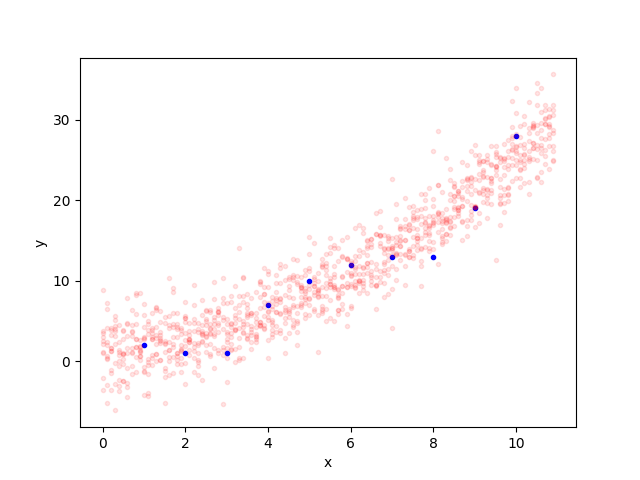

# Pangolin

Pangolin is an interface for probabilistic reasoning focused on **fun**. The goal is to be the "first" probabilistic programming language, to bring out the underlying mathematical elegance and simplicity of probabilistic reasoning, and to make easy things easy.  It should feel particularly natural to Python programmers familiar with numpy.

Most of the actual *work* of Pangolin is done by Martin Plummer's amazing [JAGS](https://sourceforge.net/projects/mcmc-jags/) package. Essentially, Pangolin is a Python interface that generates JAGS code and then calls JAGS on demand when you ask for answers. (JAGS is a descendent of the original [BUGS](https://en.wikipedia.org/wiki/WinBugs) program from the late 80s, and an inspiration for other well-used tools like [STAN](https://mc-stan.org/).)

Note: Pangolin is "academia-ware". It's not a package, it's a single 1800 line file written by one person. (Packages aren't fun, single files are fun) I've written a lot of tests, but it's likely that that more bugs remain. I would say that Pangolin was "alpha" but that would seem to imply a level of competence or at least aspiration that doesn't really exist here.

# Quick examples

Here's Tverysky and Kehneman's famous 1982 taxicab problem: There's a city where 85% of taxis are green and 15% are blue. People are known to be able to remember the color of a taxi 80% of the time. If someone says the taxi is blue, what are the odds that the taxi is green?

```python
from pangolin import d,t,P

cab_col  = d.bern(0.85)                  
obs_prob = t.ifelse(cab_col==1, 0.8, 0.2)
obs_col  = d.bern(obs_prob)
P(cab_col==1,Given(obs_col==0)))

>> 0.5862
```

And here's a simple nonlinear regression model.

```python
from pangolin import d,t,sample
import numpy as np
from matplotlib import pyplot as plt

# training data
x_train = [1,2,3,4,5,6,7,8,9,10]
y_train = [2,1,1,7,10,12,13,13,19,28]

# test inputs
x_test = np.arange(0,11,.1)

# model for training and test data
w0     = d.norm(0,.10)      # bias term
w1     = d.norm(0,.10)      # linear term
w2     = d.norm(0,.10)      # quadratic term
s      = t.exp(d.norm(0,1)) # noise strength
y      = [d.norm(w0 + w1*xi + w2*xi**2,1/s) for xi in x_train]
y_test = [d.norm(w0 + w1*xi + w2*xi**2,1/s) for xi in x_test]

# list of observations
observations = [yi==y_traini for (yi,y_traini) in zip(y,y_train)]

# do inference
y_pred = sample(y_test,Given(*observations))

# plot results
plt.plot(x_train,y_train,'b.')
plt.plot(x_test,np.array(y_pred)[:,::100],'r.',alpha=0.1);
plt.xlabel('x')
plt.ylabel('y')
plt.savefig('regression.png')
```



# FAQ

* Why use JAGS rather than [STAN](https://mc-stan.org/) or [NumPyro](https://num.pyro.ai/en/stable/getting_started.html) or [PyMC](https://www.pymc.io/welcome.html)?

Mostly because JAGS supports discrete variables. Discrete variables are really useful *especially* when people are learning about probabilistic inference for the first time, which is the setting JAGS is intended for.

Even so, these other systems are based on Hamiltonian Monte Carlo rather than Gibbs sampling and so tend to perform better on "harder" problems. So I've been wondering if this might have been a mistake and it might be worth trying to support multiple backends.

* Why Pangolin?

Pangolins are cool.

# Installation

1. Install JAGS and make sure that it is in your path.
2. Pangolin is a file. Download `pangolin.py` it and put it in the directory you're working.

# API

At a high level, this is the full API:
* `d.*` - distributions
* `t.*` - transformations
  * Also the infix operators `+`, `*`, `/`, `**`, and `@`
* `IID`, `vmap`, `recurse`, `scan` - vectorization operators
* `sample`, `E`, `P`, `var`, `std`, `cov`, `corr` - inference
* `I` - Iverson operator (convert equality to random variable)
* `makerv` convert a number or numpy array to a random variable (rarely needed)
* `jags_code` - see raw JAGS code

## Distributions

**Continuous univariate distributions** (sec 9.2.1 of JAGS user manual)

```
d.beta(a,b)        - beta
d.chisqr(a)        - Chi squared
d.dexp(a,b)        - Double eponential (or laplace)
d.exp(a)           - Exponential
d.f(a,b)           - F distribution
d.gamma(a,b)       - gamma
d.gen_gamma(a,b,c) - generalized gamma
d.logis(a,b)       - logistic distribution
d.lnorm(a,b)       - lognormal distribution
d.nchisqr(a,b)     - Non-central chi-squared
d.nt(a,b)          - non-central t
d.norm(a,b)        - Normal distribution **USES PRECISION NOT VARIANCE**
d.par(a,b)         - Pareto
d.t(a,b,c)         - Student T
d.unif(a,b)        - uniform
d.web(a,b)         - Weibull
```

**Discrete univariate distributions**  (sec 9.2.2 of JAGS user manual)

```
d.bern(a)        - Bernoulli
d.binom(a,b)     - Binomial
d.cat(a)         - Categorical
d.hyper(a,b,c,d) - noncentral hypergeometric
d.negbin(a,b)    - negative binomial
d.pois(a)        - Poisson
```

**Multivariate** (sec 9.2.3 of JAGS user manual)


```
d.dirch(a)        - Dirichlet
d.mnorm(a,b)      - multivariate normal **USES PRECISION NOT VARIANCE**
d.mnorm_vcov(a,b) - multivariate normal **THIS ONE USES COVARIANCE**
d.mt(a,b,c)       - Multivariate t
d.multi(a,b)      - Multinomial
d.sample(a,b)     - sampling without replacement (JAGS user manual has typo in title)
d.wish(a,b)       - Wishart
```

There's also one special distribution, a special sampling module has to be loaded if you use it:

```
d.normmix(a,b,c) - mixture of 1-D normals
```

**CDFs etc** (A seemingly somewhat random subset of the scalar distributions provide CDFs and quantiles (inverse CDFs) — table 6.2 of JAGS user manual)

You can do things like 

```
d.norm(0,1).cdf(.7)
d.norm(0,1).quantile(-0.5)
```

## Transformations

t.sum(a) - sum of elements in a 1-d vector
t.ifelse(x,a,b) - x must be an Equality. If x is true, gives a otherwise b.
t.equals(a,b) - 1 if a equals b otherwise 0

**Scalar functions**  (see table 9.1 in JAGS user manual)

These functions are all automatically vectorized according to JAGS rules. If `fun` is a scalar function you can do `fun(a,b,c)` provided that either:
* All `a`, `b`, and `c` are scalars
* All `a`, `b`, and `c` are arrays of the same shape
* Some of `a`, `b`, and `c` are scalars and the rest are arrays of the same shape

Most of these names are self-explanatory.

```
t.pow(a,b)
t.abs(a)
t.arccos(a)
t.arccosh(a)
t.arcsin(a)
t.arcsinh(a)
t.arctan(a)
t.arctanh(a)
t.cos(a)
t.cosh(a)
t.cloglog(a)
t.exp(a)
t.icloglog(a)
t.ilogit(a)
t.log(a)
t.logfact(a)
t.loggam(a)
t.logit(a)
t.phi(a)
t.probit(a)
t.round(a)
t.sin(a)
t.sinh(a)
t.sqrt(a)
t.step(a)
t.tan(a)
t.tanh(a)
t.trunc(a)
```

**Scalar functions triggered by infix operators**

```
a + b - same as t.add(a,b) - elementwise addition
a / b - same as t.div(a,b) - elementwise division
a * b - same as t.mul(a,b) - elementwise multiplication
```

**Matrix functions**

```
a @ b - same as t.matmul(a,b) - matrix multiplication
```

Matrix multiplication (`t.matmul` / `@`) tries to copy the semantics of numpy's `@` operator. You can only do it when `a` and `b` are both 1-d or 2-d arrays with compatible dimensions

```
a.T - same as t.t(a) - transpose
```

## Indexing

If `a` is a 1-D array, you can do `a[b]` where `b` is:
* An integer-valued random variable
* Any slice with constant indices

Currently you can't index N-D arrays at all (although you can implicitly do this through vectorization)

## Vectorization

The following operators are for efficient vectorization: They allow you to express random variables that ultimately compile to `for` loops in JAGS. The principal reason to use them is for efficiency.

### IID

```
IID(x,N)
```

If `x` is any random variable, this returns a new random variable that is `N` iid copies of `x`. The new/independent dimensions are placed first. For example, if `x` were a random variable with shape `(3,2)` then `IID(x,4)` would return a random variable with shape `(4,3,2)`.

### vmap

This is slightly more general (and more complex) than `IID)`, (`IID` is implemented using `vmap`)

```
vmap(f)(*args)
```

Suppose that `f` is a function that takes some number of inputs and produces a random variable. Then `vmap(f)` is  function that takes the same number of inputs and produces another random variable output, except all inputs and outputs are "expanded" along a new dimension (the first one).

More generally, you can do

```
vmap(f,vec_pars)(*args)
```

In this case, `vec_pars` is a list of `bool`s. This says if each parent variable should be vectorized.

For example, these are legal uses of `vmap`:

* `vmap(d.norm)([1,2,3],[4,5,6])`  
  a normal distribution with mean `[1,2,3]` and diagonal precision `[4,5,6]`.
* `vmap(d.norm,[True,False])([1,2,3],4)`  
  a normal distribution with mean `[1,2,3]` and diagonal precision `[4,4/4]`.
* `vmap(d.norm,[False,True])(1,[4,5,6])`  
  a normal distribution with mean `[1,1,1]` and diagonal variance `[4,5,6]`.

You can't do `vmap(d.norm,[False,False])` since this doesn't vectorize over anything. (If you want this, use `IID`.)

### recurse

```
out = recurse(f)(init,input)
```

This is semantically equivalent to this python code:

```
carry = init
out = []
for my_input in input:
    carry = f(carry,my_input)
    out.append(carry)
return np.stack(out)
```

This also works when there are multiple inputs, e.g. you can do

```
out = recurse(f,init,input1,input2)
```

Which is semantically equivalent to:

```
carry = init
out = []
for my_input in input:
    carry = f(carry,my_input)
    out.append(carry)
return np.stack(out)
```

### scan

This is slightly more general (and more complicated) than `recurse`. (`recurse` is implemented using `scan`)

A call to `scan` looks much like a call to `recurse`:

```
out = scan(f)(init,input)
```

The difference is that in `scan`, `f` is assumed to be a function that produces *two* outputs. One is the "carry" and the other is the "output". The above call corresponds roughly to:

```
carry = init
out = []
for my_input in input:
    carry,my_out = f(carry,my_input)
    out.append(my_out)
return np.stack(out)
```

## Equalities

If `x` and `y` are random variables and you do `x==y`, this produces an `Equality` object. You also get an equality if you do `x>=y` or `x<=y`.

`Equality`s are *not* random variables. If you want to convert an `Equality` into a random variable you should use `I` (the Iverson operator).

So, for example,

```
I(x==y)
```

is a random variable that is 1 if x==y and 0 otherwise.

## Inference

The most basic routine is sampling

```
sample(x)                      - get samples for the random variable x
sample(x,niter=50)             - do 500 iterations (default 1000)
sample(x,Given(y==2))          - get conditional samples
sample([x,y],Given(z==2,u>=7)) - conditional samples for two variables
```

But for convenience you can also get expectations

```
E(x)
E([x,y])
E([x,y],Given(z==2,u>=7),niter=50)
```

You can similarly use `P` for probabilities (or densities), `var` for the variance (elementwise over all inputs) `std` for the standard deviation (elementwise) `cov` for the covariance (scalars only) and `corr` for the covarince (scalars only). All these methods are computed using a single set of samples so the results can't be nonsensical—e.g. `var` cannot be negative, `corr` cannot be larger than one.

## Misc

```
jags_code(x)
```

This shows the JAGS code that the model would output for random variable `x` (or list of random variables) In principle you should never need to use this but might be useful in practice.