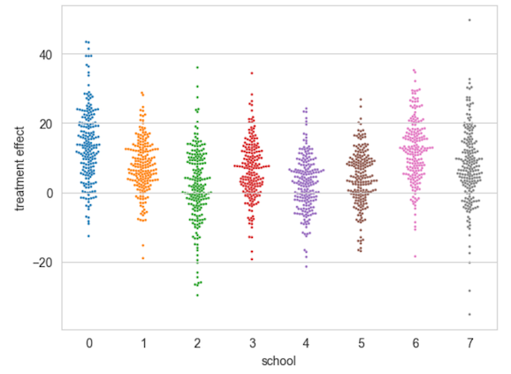

Pangolin's goal is to be **the world's friendliest probabilistic programming language** and to make probabilistic inference **fun**. It is still something of an early-stage research project.

## Installation

See [`INSTALL.md`](INSTALL.md)

## Changelog

See [`CHANGELOG.md`](CHANGELOG.md)

## API Docs

See [justindomke.github.io/pangolin](https://justindomke.github.io/pangolin/).

## Examples

Simple "probabilistic calculator":

```python
from pangolin import interface as pi
from pangolin.blackjax import E

x = pi.normal(0,2) # x ~ normal(0,2)
y = pi.normal(x,6) # y ~ normal(x,6)
print(E(x,y,-2.0)) # E[x|y=-2] (close to -0.2)
```

Bayesian inference on the 8-schools model:

```python
import pangolin as pg
from pangolin import interface as pi

# data for 8 schools model
num_schools = 8
observed = [28, 8, -3, 7, -1, 1, 18, 12]
stddevs = [15, 10, 16, 11, 9, 11, 10, 18]

# define model
mu = pi.normal(0,10)                                             # μ ~ normal(0,10)
tau = pi.exp(pg.normal(5,1))                                     # τ ~ lognormal(5,1)
theta = [pi.normal(mu,tau) for i in range(num_schools)]          # θ[i] ~ normal(μ,τ)
y = [pi.normal(theta[i],stddevs[i]) for i in range(num_schools)] # y[i] ~ normal(θ[i],stddevs[i])

# do inference / sample from p(theta | y=observed)
theta_samps = pg.blackjax.sample(theta, y, observed, niter=10000)


# plot results (no pangolin here!)
import numpy as np
import seaborn as sns
from matplotlib import pyplot as plt
sns.swarmplot(np.array(theta_samps)[:,::50].T,s=2,zorder=0)
plt.xlabel('school')
plt.ylabel('treatment effect')
```



If you're in the market for a PPL, you might want to compare the above to the same (or close) model implemented in other PPLs:


| PPL                                                                                                    | Comment                                                                                                                                                                                           |
|--------------------------------------------------------------------------------------------------------|---------------------------------------------------------------------------------------------------------------------------------------------------------------------------------------------------|
| [Pyro](https://forum.pyro.ai/t/hierarchical-models-and-eight-schools-example/362)                      | Requires "sample" statements, passing variable names as strings, and uses slightly mysterious `plate` construct.                                                                                  |
| [NumPyro](https://github.com/pyro-ppl/numpyro?tab=readme-ov-file#a-simple-example---8-schools)         | Requires "sample" statements, passing variable names as strings, and uses slightly mysterious `plate` construct.                                                                                  |
| [PyMC](https://github.com/stan-dev/posteriordb/issues/117#issuecomment-567552694)                      | Pretty good, though requires creating a "model" function and passing variables names as strings.                                                                                                  | 
| [JAGS](https://rstudio-pubs-static.s3.amazonaws.com/15236_9bc0cd0966924b139c5162d7d61a2436.html)       | Pretty good, both simple and explicit. We had this in 1991! Requires using a separate language.                                                                                                   |
| [Stan](https://www.maths.usyd.edu.au/u/jormerod/Workshop/Example1/Example1.html#:~:text=school_model3) | Looks very simple, but uses somewhat subtle batching semantics. Could be written similarly to the JAGS model, just with mandatory declarations of all types/shapes. Requires a separate language. |
| [Tensorflow probability](https://www.tensorflow.org/probability/examples/Eight_Schools)                | Legend has it that some find this a wee bit complicated.                                                                                                                                          |

For more examples, take a look at the [demos](demos/). Here's a recommended order:

* [IR.ipynb](demos/ir.ipynb) demonstrates pangolin's internal representation of probabilistic models.
* [interface.ipynb](demos/interface.ipynb) demonstrates pangolin's friendly interface and what internal representation it produces.
* [8schools.ipynb](demos/8schools.ipynb) is the classic 8-schools model.
* [regression.ipynb](demos/regression.ipynb) is Bayesian linear regression.
* [timeseries.ipynb](demos/timeseries.ipynb) is a simple timeseries model.
* [autoregressive.ipynb](demos/autoregressive.ipynb) is an autoregressive Kalman-filter-esque model.
* [GP-regression.ipynb](demos/GP-regression.ipynb) is Gaussian Process regression.


## Values

(For the current Python interface)

* **Gradual enhancement.** Easy things should be *really* easy. More complex features should be easily discoverable. Steep learning curves should be avoided.
* **Small API surface.** The set of abstractions the user needs to learn should be as small as possible.
* **Graceful interop.** As much as possible, the system should feel lke a natural part of the broader Python NumPy ecosystem, rather than a "new language".
* **Look like math.** As much as possible, calculations should resemble mathematical notation. Exceptions are allowed when algorithmic limitations make this impossible or where standard mathematical notation is ambiguous or bad.

## Long-term goals

Long-term, Pangolin has the following goals:

1. To "decouple" probabilistic models from inference algorithms. It should be possible to write a model *once*, and then perform inference using many inference "backends". (Among other things, this should facilitate benchmarks)
2. To make it easier to experiment with novel inference algorithms that inspect the target distribution. 
3. To support different possible interfaces, in different languages.
4. To be "unopinionated" about how users might specify models, and how inference might be done.


## See also

An earlier version of Pangolin is available and based on much the same ideas, except only supporting JAGS as a backend. It can be found with documentation, in the 
[`pangolin-jags`](pangolin-jags) directory.
